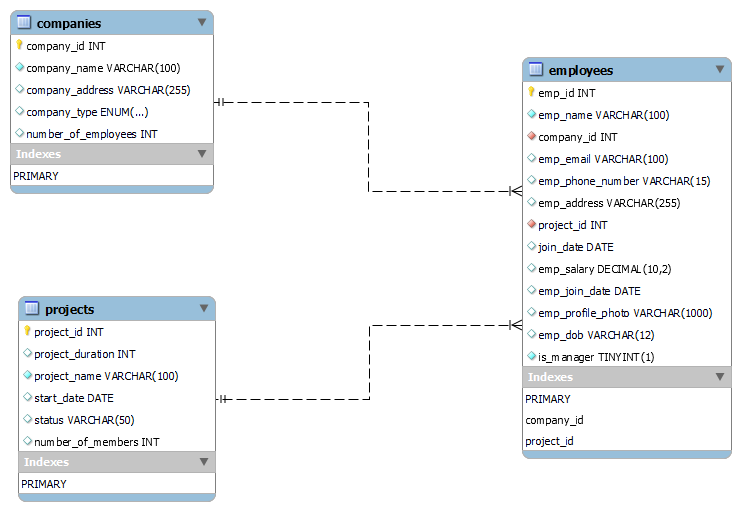

# Company Database Management System

## Description

The Company Database Management System is a Django web application designed to manage and store information about companies, their employees, and the projects they are working on. This application allows users to create, update, and view records for companies, projects, and employees, all while handling relationships between these entities.

## Technologies Used

This project utilizes the following technologies:

- **Django**: A high-level Python web framework used to develop the application backend and handle database operations.
- **MySQL**: A relational database management system for storing and managing data. It integrates with Django via Django’s ORM (Object-Relational Mapping).

- **Git & GitHub**: Version control and collaboration tools for managing the project's source code and tracking changes.


## Database Overview

The `companydb` database includes three primary tables, managed by Django models:

- **companies**: Stores information about various companies.
- **projects**: Contains details about the projects undertaken by the companies.
- **employees**: Manages data related to the employees working for the companies.

## Table Structure (Django Models)

### 1. Company Model

- **company_id**: Unique identifier for each company (Primary Key).
- **company_name**: Name of the company.
- **company_address**: Address of the company.
- **company_type**: Type of the company (`tech`, `nontech`, `financial`, `healthcare`).
- **number_of_employees**: Total number of employees in the company.

### 2. Project Model

- **project_id**: Unique identifier for each project (Primary Key).
- **project_duration**: Duration of the project (in days or months).
- **project_name**: Name of the project.
- **start_date**: Start date of the project.
- **status**: Current status of the project.
- **number_of_members**: Number of members assigned to the project.

### 3. Employee Model

- **emp_id**: Unique identifier for each employee (Primary Key).
- **emp_name**: Name of the employee.
- **company**: Foreign key to the Company model.
- **emp_email**: Email address of the employee.
- **emp_phone_number**: Phone number of the employee.
- **emp_address**: Address of the employee.
- **project**: Foreign key to the Project model.
- **join_date**: Date when the employee joined the company.
- **emp_salary**: Salary of the employee.
- **emp_join_date**: Date when the employee joined the project.
- **emp_profile_photo**: URL or file path of the employee's profile photo.
- **emp_dob**: Date of birth of the employee.
- **is_manager**: Boolean indicating if the employee is a manager.

## Getting Started

1. **Clone the repository**:
   ```bash
   git clone https://github.com/yourusername/companydb.git
   ```
   
2. **Set up the virtual environment**:
   ```bash
   python -m venv venv
   source venv/bin/activate  # On Windows, use venv\Scripts\activate
   ```

3. **Install dependencies**:
   ```bash
   pip install -r requirements.txt
   ```

4. **Configure the database**:
   - Ensure MySQL is running.
   - Update `DATABASES` in `settings.py` with your MySQL credentials.

5. **Run migrations**:
   ```bash
   python manage.py migrate
   ```

6. **Run the Django development server**:
   ```bash
   python manage.py runserver
   ```
# Company Database Management System



## Description

The Company Database Management System is a Django web application designed to manage and store information about companies, their employees, and the projects they are working on. This application allows users to create, update, and view records for companies, projects, and employees, all while handling relationships between these entities.

## Usage

Access the application in your web browser at `http://127.0.0.1:8000/`. Use the provided web interface to manage companies, projects, and employees, or interact with the database directly through Django’s ORM.


## License

This project is licensed under the MIT License - see the [LICENSE](LICENSE) file for details.

---

This README provides a clear overview of your Django project, guiding users on setup and usage without diving into code details in the README itself. Adjust the `requirements.txt` and `settings.py` instructions as needed based on your project setup!